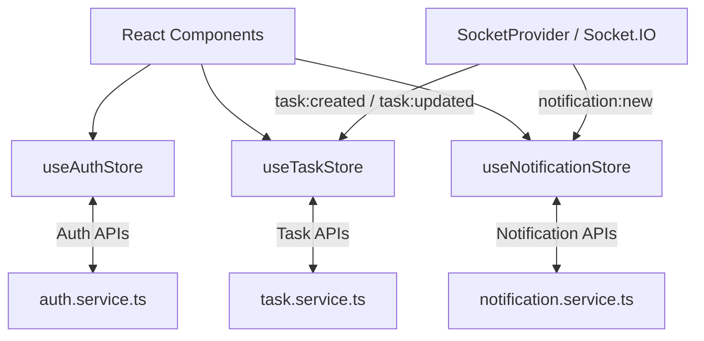
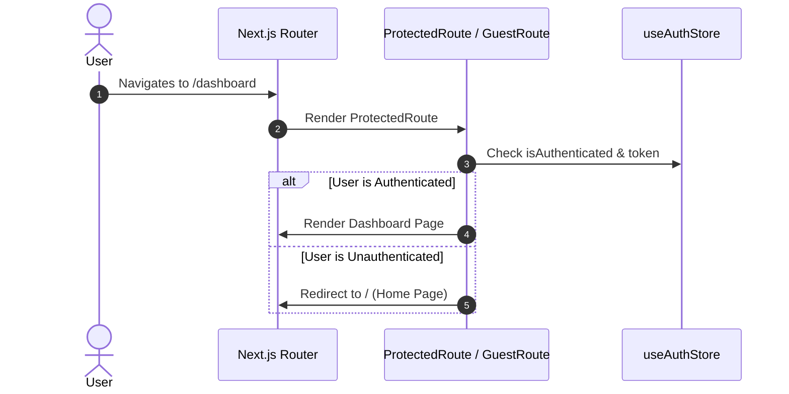

# Frontend Documentation - Real-Time Task Board Client

Production-grade Next.js 15 & React 19 application featuring an interactive **Real-Time Kanban Board**, **Socket.IO live synchronization**, **Google Gemini AI-assisted subtask generation**, **Cross-Browser DateTime Picker**, debounced search & filter controls, and responsive UI components.

---

## 📌 Features

- 📋 **Interactive Real-Time Kanban Board**:
  - Drag-and-drop task status management across Pending, In Progress, and Completed columns.
  - In-card status dropdown (`Pending`, `In Progress`, `Completed`) for instant updates.
  - Interactive subtask checklists directly inside Kanban cards with automatic parent task completion.
- ⚡ **Real-Time Board Sync**:
  - Direct WebSocket connection using `socket.io-client`.
  - Automatically updates local task lists, Kanban columns, and notification indicators when tasks are created, edited, completed, or deleted across active sessions.
- 🤖 **AI Subtask Generation UX**:
  - Interactive AI suggest subtasks form workflow powered by Google Gemini.
  - Form controls automatically locked with progress status banner during generation (`Generating AI subtasks, please wait...`).
  - Full subtask review, title editing, completion toggle, and removal before saving.
- 📅 **Cross-Browser DateTime Picker**:
  - Custom popover calendar and time selector providing 100% consistent UX across Chrome, Edge, Firefox, Safari (macOS & iOS), and Arc Browser.
- 🛡 **Route Protection**:
  - `ProtectedRoute`: Redirects unauthenticated users to `/`.
  - `GuestRoute`: Redirects authenticated users from `/login` & `/signup` to `/dashboard`.
- 📱 **Mobile & Desktop Layout Optimization**:
  - Responsive horizontal snap-scrolling on mobile devices and responsive 3-column grid on desktop.
  - Mobile responsive notification dropdown with zero horizontal overflow.
  - Server-side paginated grid and board views.

---

## 🛠 Tech Stack

| Technology | Purpose |
|---|---|
| **Next.js 15 (App Router)** | React framework & page routing |
| **React 19** | Component rendering & state hooks |
| **TypeScript** | Type-safe props and state |
| **Tailwind CSS v3.4** | Utility-first responsive styling |
| **Zustand v5** | Lightweight global state management |
| **React Hook Form + Zod** | Form handling & validation schemas |
| **Axios** | HTTP API client with interceptors |
| **Socket.IO Client** | Live WebSocket event receiver |
| **Lucide React & React Hot Toast** | Icon sets and notification UI |

---

## 📂 Folder Structure

```text
client/
├── src/
│   ├── app/                # Next.js App Router pages
│   │   ├── dashboard/      # Dashboard page
│   │   ├── login/          # Login page
│   │   ├── notifications/  # Notifications dedicated view
│   │   ├── signup/         # Signup page
│   │   ├── globals.css     # Tailwind imports & custom scrollbar styles
│   │   ├── layout.tsx      # Root layout with providers
│   │   ├── not-found.tsx   # 404 redirect handler
│   │   └── page.tsx        # Home landing page
│   ├── components/         # Modular React components
│   │   ├── auth/           # LoginForm, SignupForm, ProtectedRoute, GuestRoute
│   │   ├── common/         # Pagination, Modal containers
│   │   ├── dashboard/      # DashboardHeader, SummaryCards
│   │   ├── kanban/         # KanbanBoard, KanbanColumn, KanbanCard
│   │   ├── layout/         # Navbar
│   │   ├── notification/   # NotificationCenter, NotificationItem
│   │   ├── task/           # TaskCard, TaskList, TaskModal, TaskForm, AISubtaskButton
│   │   └── ui/             # Reusable UI primitives (Input, Button, DateTimePicker)
│   ├── providers/          # Auth, Socket, and Toast Providers
│   ├── services/           # Axios API services (auth, task, ai, notification)
│   ├── store/              # Zustand global stores
│   ├── types/              # TypeScript interfaces (task, auth, notification)
│   └── utils/              # Zod validation schemas
├── .env.local
├── package.json
└── tailwind.config.ts
```

---

## ⚙️ Environment Variables

Create `.env.local` in the `client/` directory:

```env
NEXT_PUBLIC_API_URL=http://localhost:5000/api
NEXT_PUBLIC_SOCKET_URL=http://localhost:5000
```

---

## 🚀 Running Development & Production

### Development Mode

```bash
npm run dev
```

The application will start on `http://localhost:3000`.

### Production Build

```bash
npm run build
npm start
```

---

## 🗃 Global State Architecture (Zustand)



### Store Responsibilities:
1. `useAuthStore`: Manages user credentials, authentication state, login, signup, and logout.
2. `useTaskStore`: Manages server-side pagination, search queries, status/priority filters, view mode (`kanban` vs `grid`), task creation, editing, status updates, and deletion.
3. `useNotificationStore`: Manages unread notification counts, notification dropdown visibility, and live socket listeners.

---

## 🔒 Route Protection Flow



---

## 📜 License

This project is licensed under the [MIT License](../LICENSE).
